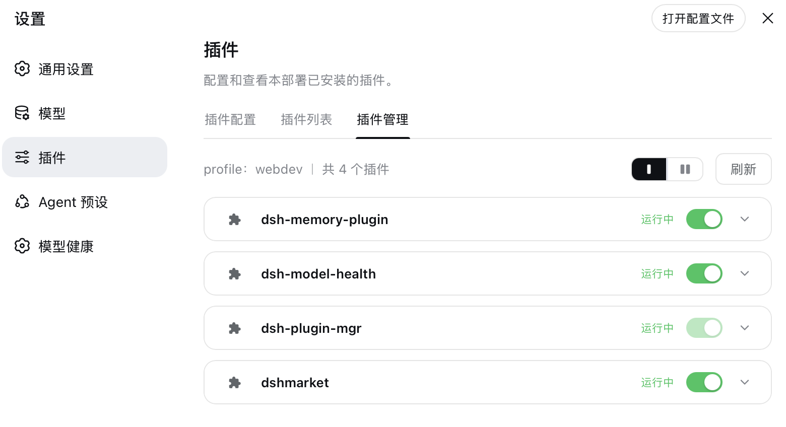
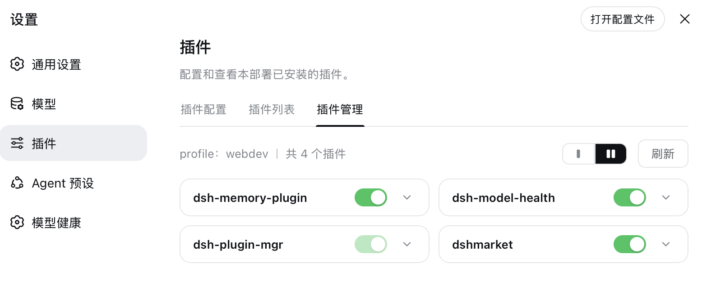

# dsh-plugin-mgr

[](https://www.npmjs.com/package/dsh-plugin-mgr)
[](#license)

> DeepSeek Harness (DSH) plugin: a "Plugin Manager" sub-page inside Settings → Plugins — manage installed plugins as cards with enable/disable toggles, details, and uninstall.
>
> 中文文档：[README](README.md)





## Features

| # | Form | Description |
|---|------|-------------|
| 1 | Installed plugin list | Card layout with single / two column toggle (preference remembered); shows name, version, running state, and an enable/disable switch |
| 2 | Enable / disable | Writes `disabled: true/false` through the profile user patch layer (`cordis.patch.yml`); DSH HMR applies it in ~1s, survives restarts |
| 3 | Expandable details | Click a card to expand: version / source (npm·GitHub·local classification + version range + clickable repository link) / description |
| 4 | Uninstall | Uninstall button in the expanded details (with confirmation); cleans up patch rows first, then runs `dsh plugin --profile <name> remove <pkg>` |
| 5 | Update check + one-click update | npm-sourced plugins are compared against the registry latest (results cached 5min); outdated cards show an "Update" badge and the details offer one-click update to latest; existing enable/disable state is preserved across updates |
| 6 | Search | Toolbar search box (matches name/description/spec, case-insensitive); the count shows "x / y" while filtering, with a one-click clear when nothing matches |
| 7 | Runtime error display | Listens to the host fiber status events: a plugin that failed to load gets a red "Load failed" state on its card with the error message in its details; recovery (HMR fix / rollback restart) clears it automatically |

**Highlights:**

- Modern card UI aligned with the official DSH settings card design language (bg-layer-3 surface, 12px radius, hover highlight)
- Light/dark theme support (all colors from theme CSS variables); bilingual zh/en (follows the harness language setting, switches instantly)
- Refresh gives clear feedback: button state change + a "Refreshed · time" banner
- Safety guards: host infrastructure modules refuse toggling/uninstalling; the manager's own switch and uninstall are grayed out (hover shows "This plugin"), double-checked host-side
- Patch-layer writes are serialized (no interleaved read-modify-write), restore the empty `[]` placeholder (never brick the profile), and refuse malformed YAML
- Update checks hit the npm registry, resolved as: `DSH_PLUGIN_MGR_REGISTRY` env > `npm_config_registry` > profile/.npmrc > ~/.npmrc > npmjs.org (mirror-aware, e.g. npmmirror); npm-sourced plugins only, host modules and self-guarding follow the same policy as uninstall
- Runtime error capture rides the cordis `internal/status` event (`global: true` bypasses the context filter): FAILED fibers are attributed to their package via `fiber.entry.options.name`, the error message comes from `fiber.await()` rethrowing it, and returning to ACTIVE clears the record — no polling, failures and recoveries are both noticed instantly
- POST endpoints require `Content-Type: application/json` (CSRF guard) with a 64KB body cap

## How it works

The plugin consists of a host side and a client side (declared via the `dsh.client` field in `package.json`):

```
┌─ host side   src/index.ts → dist/index.js ──────────────────────┐
│  ctx.webServer.register:                                          │
│    GET  /api/plugin-manager/list     reads profile deps + patch   │
│    GET  /api/plugin-manager/updates  compares npm registry latest │
│    POST /api/plugin-manager/toggle   enable/disable (patch layer) │
│    POST /api/plugin-manager/uninstall spawns dsh plugin remove    │
│    POST /api/plugin-manager/update   spawns dsh plugin add @latest│
│  profile location: the loader's cordis:include entry path         │
└──────────────────────────────────────────────────────────────────┘
                          │ fetch (JSON)
┌─ client side src/client.js (browser module) ─────────────────────┐
│  injects the "Plugin Manager" tab via the settings.plugins.tab    │
│  React card list + switches + accordion details; zh/en dicts      │
│  registered through the locale service                            │
└──────────────────────────────────────────────────────────────────┘
```

The toggle mechanism (same lineage as dshmarket / dsh-plugin-hub's plugin console): the profile user patch layer applies per-row override semantics — `- id: X` + `disabled: true` disables, `disabled: false` force-enables — and DSH's config hot-reload (HMR) recomposes the plugin tree within ~1s.

## Install

### From npm (recommended)

```sh
dsh plugin --profile web add dsh-plugin-mgr
```

### From source / GitHub

```sh
git clone https://github.com/oxlyn/dsh-plugin-mgr.git
cd dsh-plugin-mgr && pnpm install && pnpm run build

# Run from the PARENT directory (dsh plugin add anchors relative
# paths to the invoking directory):
cd ..
dsh plugin --profile web add ./dsh-plugin-mgr
dsh web
# Startup log should show: [dsh-plugin-mgr] ready — routes GET /api/plugin-manager/list ...
```

Install straight from GitHub (prepare builds dist automatically):

```sh
dsh plugin --profile web add github:oxlyn/dsh-plugin-mgr
```

### Verify

Open `dsh web` → Settings → Plugins → the "Plugin Manager" tab; you should see cards for installed plugins.

## Requirements

- Node `^22.19.0 || >=24.0.0` (required by the DSH host)
- pnpm (for building from source)

## Development

```sh
pnpm install
pnpm run typecheck   # type checking
pnpm run build       # build dist/
```

Project layout:

```
dsh-plugin-mgr/
├── src/index.ts          # host side: list/updates/toggle/uninstall/update routes + patch-layer I/O
├── src/client.js         # client side: manager tab (card UI + zh/en dictionaries)
├── cordis.patch.yml      # bundle layer declaration (id/name resolve as package names)
└── dist/                 # build output (included in the published files field)
```

## Links

- [LinuxDo](https://linux.do)

## License

[MIT](LICENSE)
